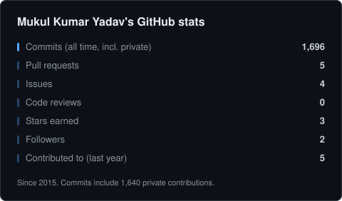
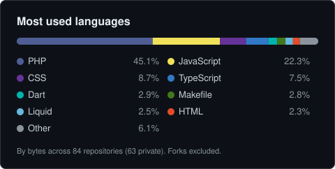
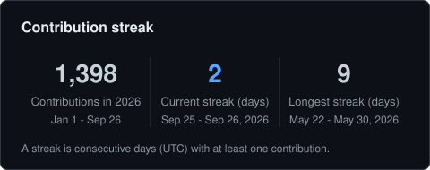

# truestats

GitHub profile stat cards that count what you actually did, generated inside your
own repository with your own token. No third-party server, no rate-limited image
endpoint, private contributions included.

[](https://github.com/mk24x7/truestats/actions/workflows/ci.yml)
[](LICENSE)

## Why

Most profile READMEs embed images from a shared public deployment of
github-readme-stats or one of its cousins. That has two problems:

1. **The shared servers go away.** On 2026-09-26 the public github-readme-stats
   deployment answers `HTTP 503 DEPLOYMENT_PAUSED` and github-profile-trophy answers
   `HTTP 402 DEPLOYMENT_DISABLED`. Every profile that embeds them shows a broken image.
2. **They undercount.** A shared server only sees public activity. If most of your
   work happens in private repositories (as it does for most professional
   engineers), the cards say you barely code.

truestats runs as a GitHub Action in your profile repository. It queries the GitHub
GraphQL API with a token you control, renders plain SVG files, and commits them next
to your README. The images are served by GitHub itself, so they never rate-limit and
never depend on someone else's hosting bill.

## What it looks like

These are the real cards for [@mk24x7](https://github.com/mk24x7), generated by this
repository's CLI and committed to [`cards/`](cards):

<p align="center">
  
  
</p>
<p align="center">
  
  
</p>

Cards:

| Card | Shows |
| --- | --- |
| `stats` | All-time commits (private contributions included), pull requests, issues, code reviews, stars earned, followers, repositories contributed to in the last year |
| `languages` | Top N languages by bytes across every repository the token can see, as a stacked bar plus legend; forks and archived repositories excluded by default |
| `streak` | Contributions this calendar year, current streak, longest streak (all time) |
| `pin` | One card per repository listed in `pins`: description, primary language, stars, forks |

Every number is real text (select and copy it), every card has a `<title>` and
`<desc>` for screen readers, and no card loads fonts, scripts or images from the
network.

## Usage

Add a workflow to your profile repository (the one named after your username), for
example `.github/workflows/truestats.yml`:

```yaml
name: truestats

on:
  schedule:
    - cron: '0 3 * * *'
  workflow_dispatch:

permissions:
  contents: write

jobs:
  cards:
    runs-on: ubuntu-latest
    steps:
      - uses: actions/checkout@v7
      - uses: mk24x7/truestats@v1
        with:
          token: ${{ secrets.TRUESTATS_TOKEN || github.token }}
          cards: stats,languages,streak
          pins: your-name/your-repo
          theme: dark
```

Run it once from the Actions tab (workflow_dispatch). It writes `cards/*.svg`,
commits them as `github-actions[bot]` with the message
`Update truestats cards [skip ci]`, and skips the commit when nothing changed. Then
embed the files in your README:

```html
<p align="center">
  
  
</p>
<p align="center">
  
  
</p>
```

Pin card files are named `pin-<owner>-<name>.svg` in lower case.

### Layout

The default `layout` of `stats,languages;streak,pin` matches the two-column README
above: stats and languages share a row, streak and pin share the next one. Cards in
the same row are rendered at the same height (the tallest card's natural height), so
paired images line up edge to edge. Shorter cards keep their title at the same top
offset, centre their content in the extra space and keep their footer pinned to the
bottom edge. Cards not named in `layout` keep their natural height, and `pin`
applies to every pin card. Use one card per row (`stats;languages;streak;pin`) or
`none` if you stack the cards vertically instead.

### Token

| Token | What counts |
| --- | --- |
| `github.token` (the workflow `GITHUB_TOKEN`) | Public repositories, plus private contribution counts (GitHub reports these as `restrictedContributionsCount`) when "Include private contributions on my profile" is enabled in your profile settings |
| Fine-grained PAT with read access to all your repositories | Everything above, plus the languages and stars of your private repositories |

To create the PAT: Settings, Developer settings, Fine-grained tokens, Generate new
token. Choose "All repositories" and grant **Metadata: read** and **Contents: read**.
Nothing else is needed. Save it as a repository secret named `TRUESTATS_TOKEN` in
your profile repository. The commit step still uses the workflow's own token, which
is why the job needs `permissions: contents: write`.

When the token cannot see any private repository, truestats says so in the job log
instead of silently undercounting.

### Local CLI

The same code runs locally with Node 20 or newer and no dependencies:

```sh
git clone https://github.com/mk24x7/truestats && cd truestats
node src/cli.js --token "$(gh auth token)" --user your-name \
  --cards stats,languages,streak --pins your-name/your-repo --theme dark --out cards
```

## Inputs

| Input | Default | Description |
| --- | --- | --- |
| `token` | required | Token used to read GitHub data (see [Token](#token)). |
| `user` | `${{ github.repository_owner }}` | GitHub username to render. |
| `cards` | `stats,languages,streak` | Comma list of `stats`, `languages`, `streak`, `pin`. |
| `pins` | `""` | Comma list of `owner/name` repositories; one pin card each. |
| `theme` | `dark` | `light`, `dark`, `tokyonight` or `transparent`. |
| `colors` | `""` | Colour overrides, e.g. `bg=0d1117,title=58a6ff`. Keys: `bg`, `border`, `title`, `text`, `muted`, `accent`, `track`. Hex values only; `bg=none` for no background. |
| `output_dir` | `cards` | Directory the SVG files are written to. |
| `commit` | `true` | Commit and push changed cards. Set `false` to only write files (for example to upload them as an artifact). |
| `languages_count` | `8` | Languages shown on the languages card (1-20); the rest are grouped as Other. |
| `exclude_repos` | `""` | Comma list of repositories (`name` or `owner/name`) ignored for languages and stars. |
| `exclude_archived` | `true` | Ignore archived repositories for languages and stars, so old mirrors and abandoned projects do not dominate the languages card. Set `false` to include them. |
| `layout` | `stats,languages;streak,pin` | Rows of cards that share a height: rows separated by `;`, cards by `,`. See [Layout](#layout). `none` renders every card at its natural height. |

Outputs: `files` (comma list of written paths) and `committed` (`true` or `false`).

## Themes

| Theme | Background | Title | Text | Accent |
| --- | --- | --- | --- | --- |
| `dark` | `#0d1117` | `#e6edf3` | `#c9d1d9` | `#58a6ff` |
| `light` | `#ffffff` | `#1f2328` | `#24292f` | `#0969da` |
| `tokyonight` | `#1a1b27` | `#70a5fd` | `#c0caf5` | `#bf91f3` |
| `transparent` | none | `#2f81f7` | `#768390` | `#2f81f7` |

`transparent` uses mid-tone colours that stay readable on both GitHub's light and
dark page backgrounds.

## FAQ

**Why are my numbers higher than on other stat cards?**
Two reasons, both deliberate. First, private contributions are counted: GitHub
reports them as a single `restrictedContributionsCount` without a per-type
breakdown, and truestats adds that number to commits (the same convention as
github-readme-stats' `count_private` option). Second, commits are all-time: truestats
sums `contributionsCollection` for every calendar year since your account was
created instead of only the last year. Both facts are printed on the card.

**Why do my private contributions show as zero?**
Enable "Include private contributions on my profile" under your GitHub profile
settings. Without it GitHub does not expose the count to any token.

**Which token scopes do I need?**
For a fine-grained PAT: read-only Metadata and Contents on all repositories. For a
classic PAT: `repo` (read access is all that is used). The workflow `GITHUB_TOKEN`
works with no extra setup but only sees public repositories' languages and stars.

**Will I hit rate limits?**
Unlikely. A run makes one small query per 100 repositories, one per four years of
history, and one per pinned repository, typically well under 20 GraphQL points from
the 5,000 per hour your token gets. Transient server errors and secondary rate
limits are retried with backoff; an exhausted quota fails with the reset time in
the message. The rendered images are static files served by GitHub, so viewers
never trigger API calls.

**Does it show other people my private repository names?**
No. The stats, languages and streak cards only show totals. A pin card shows the
description of the repository you pin, so only pin repositories you are happy to
describe publicly.

**How is a streak defined?**
Consecutive calendar days (UTC, as reported by GitHub's contribution calendar) with
at least one contribution. A day with no contributions yet today does not break
your current streak; it ends only when yesterday was empty.

## Development

```sh
npm test               # node:test suite, no dependencies
npm run build          # bundle src/ into dist/index.js
npm run check-ascii    # every file must be pure ASCII
UPDATE_SNAPSHOTS=1 npm test   # refresh renderer snapshots after intended changes
```

`dist/index.js` is committed because GitHub runs actions straight from the
repository; CI fails when it is out of date with `src/`.

## License

[MIT](LICENSE). Copyright (c) 2026 Mukul Kumar Yadav.
